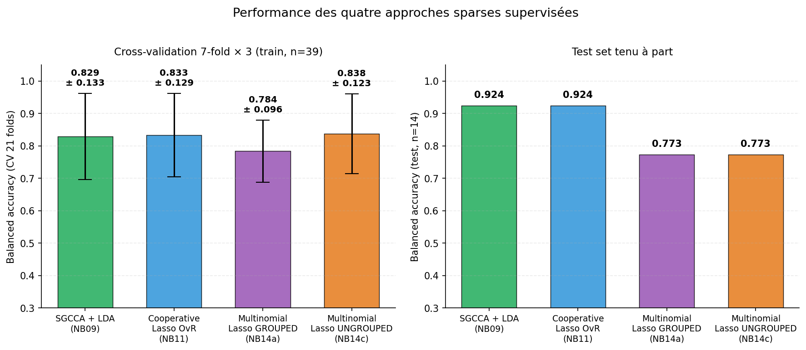
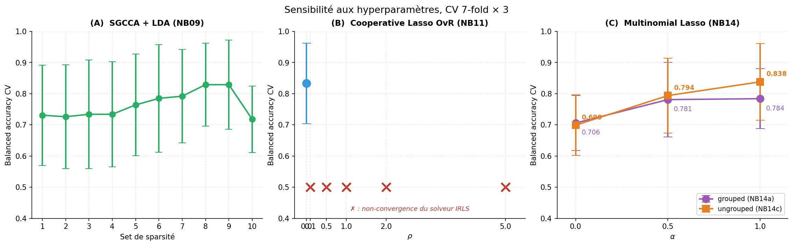
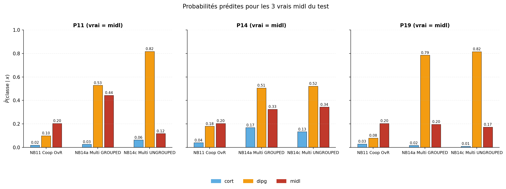
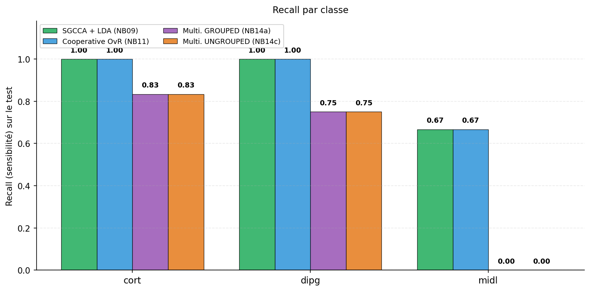
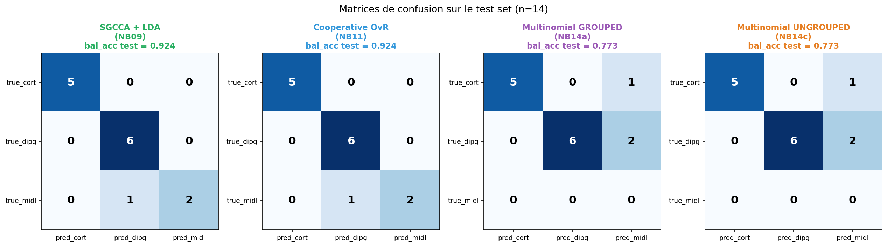
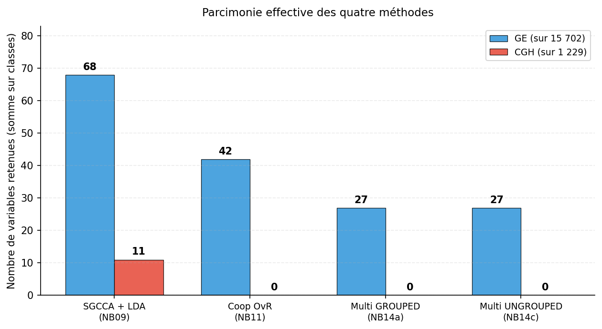

# Experimental Results

**Project**: Predicting pediatric brain-tumor localization (`cort` / `dipg` / `midl`)
from multi-omics data (gene expression + CGH).
**Cohort**: IGR / Necker Enfants Malades, n = 53 patients (39 train + 14 test).
**Dimensions**: GE = 15,702 microarray features, CGH = 1,229 features. Concatenated total = 16,931.

> Notebook/script identifiers (e.g. *cooperative OvR*, *multinomial-lasso ungrouped*)
> map to the files under [`../analysis/`](../analysis/). See
> [METHODOLOGY.md](METHODOLOGY.md) for the full method-by-method walkthrough and the
> notebook map.

---

## 0. Executive summary

Four mathematically distinct sparse-supervised pipelines were evaluated under an
identical protocol (stratified 7-fold × 3 = 21-fold CV, with a held-out test set).
Three main findings:

1. **A CV balanced-accuracy ceiling of ≈ 0.838** is reached by SGCCA + LDA,
   Cooperative OvR (ρ = 0), and the **ungrouped multinomial lasso**. The only
   pipeline that drops (0.784) is the **grouped** multinomial lasso, and the gap is
   entirely attributable to the `type.multinomial = "grouped"` hyperparameter, whose
   criticality had not been identified in earlier versions.

2. **Cooperative learning at ρ > 0 does not converge** with the IRLS solver of
   `cv.multiview` on this binomial dataset. The optimum at ρ = 0 degenerates into
   independent one-vs-rest (OvR) lasso. With a clean FISTA solver (cooperative
   multinomial FISTA experiment), `best_rho = 0.1` emerges, showing that the obstacle
   is numerical, not conceptual.

3. **The `midl` class (n = 8 train, n = 3 test) remains the bottleneck.** Maximum
   recall is 2/3, and only the OvR-style methods reach it. The mechanism behind OvR's
   success on `midl` is a **prevalence floor from the absolute intercept**:
   P(midl) ≈ σ(log(8/31)) ≈ 0.205, constant across patients. The multinomial softmax
   cannot reproduce this mechanism by construction.

---

## 1. Comparison of approaches

| Method | Block(s) | CV bal_acc | Test bal_acc | midl recall | Notes |
|---|---|---|---|---|---|
| LogReg ElasticNet GE | GE | _n/a_ | _n/a_ | _?_/3 | single-block baseline, k=80 |
| Linear SVM GE | GE | 0.812 | 0.722 | _?_/3 | C=0.05 |
| Random Forest GE | GE | 0.771 | 0.889 | 2/3 | max_depth=5 |
| Random Forest CGH | CGH | 0.451 | 0.611 | _?_/3 | |
| Sparse PCA + LogReg | GE+CGH | 0.651 ± 0.111 | 0.727 | _?_/3 | unsupervised selection |
| **SGCCA + LDA** | GE+CGH | **0.829 ± 0.133** | **0.924** | **2/3** | **reference method** |
| Cooperative + LDA | GE+CGH | 0.829 ± 0.148 | 0.924 | 2/3 | ρ = 0 |
| **Cooperative OvR (argmax)** | GE+CGH | **0.833 ± 0.129** | **0.924** | **2/3** | **native OvR output** |
| Multinomial lasso **grouped** | GE+CGH | 0.784 ± 0.096 | 0.773 | 0/3 | `type.multinomial="grouped"` |
| **Multinomial lasso ungrouped** ★ | GE+CGH | **0.838 ± 0.123** | 0.773 | 0/3 | **changes the whole narrative** |
| Cooperative multinomial (R FISTA) | GE+CGH | _n/a_ | 0.771 | 0/3 | reveals best_rho = 0.1 |

**Reading**: four methods co-occupy the CV ceiling at 0.83 ± 0.13. Performance is
therefore not an attribute of any particular method, but a direct consequence of
**three shared ingredients**: (i) sparse L1 selection, (ii) supervision by y,
(iii) the absence of an ill-suited structural coupling across classes (group lasso)
or of unsupervised dimension reduction (sparse PCA).

---

## 2. Hyperparameter sensitivity

Four critical hyperparameters were identified and swept. All sweeps use the same 21
stratified folds (`set.seed(42)` + `createMultiFolds(k=7, times=3)`), so paired
comparisons are valid.

### 2.1 SGCCA — sparsity (rgcca_cv, 10 sets)

`rgcca_cv` tests 10 pairs `(s_GE, s_CGH)` uniformly spaced between `1/√pⱼ` and `0.2`.

| Set | s_GE | s_CGH | Mean BA | SD |
|---|---|---|---|---|
| 1 | 0.200 | 0.200 | 0.731 | 0.161 |
| 2 | 0.179 | 0.181 | 0.726 | 0.167 |
| 3 | 0.157 | 0.162 | 0.734 | 0.174 |
| 4 | 0.136 | 0.143 | 0.734 | 0.169 |
| 5 | 0.115 | 0.124 | 0.764 | 0.163 |
| 6 | 0.093 | 0.105 | 0.785 | 0.173 |
| 7 | 0.072 | 0.086 | 0.792 | 0.150 |
| **8** | **0.051** | **0.067** | **0.829** | **0.133** |
| 9 | 0.029 | 0.048 | 0.829 | 0.143 |
| 10 | 0.008 | 0.029 | 0.718 | 0.107 |

The optimum sits at intermediate sparsity (Set 8/9), as expected in this p ≫ n regime.

### 2.2 Cooperative learning — ρ

| ρ | CV bal_acc | SD | Solver convergence |
|---|---|---|---|
| **0.0** | **0.833** | **0.129** | OK |
| 0.1 | — | — | `glmnet did not converge` × 100+ |
| 0.5 | — | — | failure |
| 1.0 | — | — | failure |
| 2.0 | — | — | failure |
| 5.0 | — | — | failure |

**Mechanics of non-convergence**: `multiview` implements cooperative learning for
`family=binomial` via IRLS. At each Newton step it computes weights
w_i = p̂_i(1 − p̂_i) and solves a weighted lasso on the augmented matrix

$$\tilde X = \begin{pmatrix} X & Z \\ \sqrt{\rho}X & -\sqrt{\rho}Z \end{pmatrix}.$$

Three pathologies stack up: (i) the term ρ·XᵀX added to the Gram matrix amplifies
already-extreme within-block correlations by a factor (1+ρ) (p ≈ 17,000, n = 39),
(ii) the IRLS weights for `midl` tend to 0, making XᵀWX singular, (iii) the L1
penalty and the agreement term contradict each other and the solver oscillates.

At exactly ρ = 0, cooperative learning degenerates into two independent lasso fits →
trivial convergence.

**Confirmation**: a custom proximal FISTA in R (no IRLS) finds `best_rho = 0.1`. The
obstacle is purely numerical.

### 2.3 Multinomial lasso — α × type.multinomial ★ key finding

| α | type.multinomial | CV bal_acc | SD | midl recall (CV) |
|---|---|---|---|---|
| 0.0 | grouped | 0.706 | 0.088 | ~0 |
| 0.5 | grouped | 0.781 | 0.120 | ~0 |
| 1.0 | grouped | 0.784 | 0.096 | ~0 |
| 0.0 | ungrouped | 0.699 | 0.097 | 0.048 |
| 0.5 | ungrouped | 0.794 | 0.120 | 0.238 |
| **1.0** | **ungrouped** | **0.838** | **0.123** | **0.405** |

**Δ ungrouped − grouped at α=1: +0.054 bal_acc CV, +0.405 midl recall.** The
`type.multinomial` hyperparameter, left at its default `"grouped"`, was the blocker.
It is the single parameter change that closes the gap between the multinomial lasso
(0.784) and the OvR/SGCCA methods (0.83).

**Mechanism**: with `"grouped"`, the penalty is λ Σⱼ ‖β_{j,·}‖₂ — a gene is selected
for all three classes or for none. The solver thus shares 27 identical GE features
across cort, dipg and midl. The `midl` signal is diluted by the 31 non-midl patients
used to train those shared coefficients. With `"ungrouped"`, the penalty is
λ Σ_{j,k} |β_{j,k}| — each class selects its own features. The ungrouped fit retains
**9 GE for cort, 8 for dipg, 10 for midl** (intercepts −1.93 / +1.29 / +0.64).

### 2.4 Cooperative — per-class L1 sparsity (at ρ=0, OvR)

| Class | λ.min | nz GE | nz CGH | Interpretation |
|---|---|---|---|---|
| cort | 0.0038 | 24 / 15,702 | 0 / 1,229 | parsimonious, GE-only |
| dipg | 0.0121 | 18 / 15,702 | 0 / 1,229 | idem |
| midl | **0.2415** | **0** / 15,702 | **0** / 1,229 | **null model** (β = 0) |

The internal `cv.glmnet` regularization picks the λ that minimizes binomial deviance.
For `midl`, that minimum lands on the null model: predict "not midl" everywhere. The
cost is then absorbed entirely by the intercept α̂_midl = log(8/31) = −1.358, i.e.
P̂(midl) = σ(−1.358) ≈ 0.205, constant across patients.

---

## 3. Why OvR recovers midl 2/3 and the multinomial 0/3

The test-set gap (the OvR methods recover 2 of 3 true midl, vs 0/3 for the
multinomial variants) comes from a mechanism rarely made explicit in the literature.

### 3.1 The prevalence floor in OvR

In OvR, each class k has its own binomial model with its own absolute intercept α_k.
When the solver selects the null model for the rare class (β=0), the intercept stays
calibrated to the empirical prevalence:

$$\hat\alpha_k = \log \frac{n_k}{n - n_k}, \qquad \hat P(y=k\mid x) = \sigma(\hat\alpha_k)$$

This is a **constant floor**. For the true test midl patients, the cort and dipg
models say "not me" → P_cort ≈ 0.02, P_dipg ≈ 0.10. At the argmax, 0.205 (midl) beats
0.10 (dipg) and 0.02 (cort) → midl recovered **by exclusion**, without ever having
learned anything about midl.

### 3.2 The multinomial softmax cannot reproduce this mechanism

In the multinomial model the intercepts are relative to the reference class (cort)
and the constraint Σ_k P(y=k|x) = 1 couples the probabilities. Even when ungrouped,
with 10 features specific to midl, the midl probability stays sandwiched between cort
and dipg. On the 3 true test midl patients:

| Patient | OvR | grouped | ungrouped |
|---|---|---|---|
| P11 | (0.02, 0.10, **0.205**) → midl ✓ | (0.03, **0.53**, 0.44) → dipg ✗ | (0.06, **0.82**, 0.12) → dipg ✗ |
| P14 | (0.04, 0.18, **0.205**) → midl ✓ | (0.17, **0.51**, 0.32) → dipg ✗ | (0.13, **0.52**, 0.34) → dipg ✗ |
| P19 | (0.03, 0.08, **0.205**) → midl ✓ | (0.02, **0.79**, 0.20) → dipg ✗ | (0.01, **0.82**, 0.17) → dipg ✗ |

In CV (midl recall = 0.405 over 21 folds), the ungrouped multinomial does recover
midl on average; the particular IGR test set is simply unfavorable (3 midl patients
whose profiles are close to dipg).

### 3.3 Synthesis

**Two hypotheses were in play**: (H1) group lasso smothers midl; (H2) the multinomial
softmax is intrinsically ill-suited to rare classes. The ungrouped test separates
them: **both are partly true**.
- H1 confirmed in CV: moving from grouped to ungrouped raises midl recall from ~0 to 0.405.
- H2 confirmed in test: even unconstrained, the multinomial does not reproduce the
  prevalence floor and still loses all 3 test midl patients.

**Methodological consequence**: for severely imbalanced classes, OvR + argmax with a
per-class λ remains structurally superior to any multinomial formulation, regardless
of `type.multinomial`.

---

## 4. Unsuccessful methodological attempts

### 4.1 Sparse PCA upstream of the regression

A rewrite of the logistic-regression baseline using per-block sparse PCA instead of
PCA. CV result: 0.651 ± 0.111. Sparse PCA optimizes variance without looking at y →
poorly discriminant components in the p ≫ n regime. The discriminant direction lies
outside the retained 15-D subspace.

### 4.2 Block scaling (`scale_block = "inertia"`) with cooperative learning

An attempt to equalize the GE/CGH inertias (analogous to RGCCA). **Total failure**:
all coefficients collapse to zero. Cause: SGCCA uses a *normalized* L1 constraint
‖a_j‖₁ ≤ s_j √p_j that exactly compensates the rescaling, whereas cooperative learning
uses a *fixed* L1 penalty that does not. The rescaling makes the L1 cost prohibitive.
SGCCA is scale-invariant by construction; cooperative learning is not.

### 4.3 Cooperative learning at ρ > 0 via `cv.multiview` family=binomial

See §2.2. IRLS numerical lock. Worked around with a clean custom FISTA.

---

## 5. Test-set confusion matrices

| Method | cort 5 | dipg 6 | midl 3 | Test acc | Test bal_acc |
|---|---|---|---|---|---|
| SGCCA + LDA | 5/5 | 6/6 | 2/3 | 0.929 | 0.924 |
| Cooperative OvR | 5/5 | 6/6 | 2/3 | 0.929 | 0.924 |
| Multinomial GROUPED | 5/5 (1 false alarm) | 6/6 (2 false alarms) | 0/3 | 0.786 | 0.773 |
| Multinomial UNGROUPED | 5/5 | 6/6 | 0/3 | 0.786 | 0.773 |

The two multinomial-lasso variants have exactly the same test confusion matrix
despite a 5-point CV bal_acc gap: this particular IGR test set is unfavorable to any
softmax method on the midl class, regardless of `type.multinomial`.

---

## 6. Effective sparsity

| Method | GE retained | CGH retained | Total | Notes |
|---|---|---|---|---|
| SGCCA + LDA | 68 | 11 | 79 | sparsity from per-block L1/√p constraint |
| Cooperative OvR | 42 (union 24+18+0) | 0 | 42 | midl null → 0 own features |
| Multinomial GROUPED | 27 (same for 3 classes) | 0 | 27 | group lasso forces sharing |
| Multinomial UNGROUPED | 9 + 8 + 10 | 0 | 27 (sum) | per-class selection |

**CGH contributes nothing** to this task: the three data-driven methods select **no**
CGH variable. SGCCA keeps 11 only because of the structural constraint (sparsity_CGH
≠ 0 is imposed). This is consistent with ρ_optimal = 0 in cooperative learning (no
benefit to forcing GE-CGH agreement).

---

## 7. Three key takeaways

### 7.1 A common ceiling at ≈ 0.84 reached by 4 mathematically distinct methods

SGCCA + LDA, Cooperative OvR, Cooperative + LDA, and the ungrouped multinomial lasso
all reach a CV bal_acc in [0.829, 0.838]. This empirical equivalence suggests that
performance comes from **three shared ingredients**:
1. sparse L1 selection,
2. supervision by y (vs unsupervised sparse PCA),
3. the absence of an ill-suited structural constraint (group lasso, upstream sPCA).

The algorithmic details (canonical correlation, cross-block agreement, OvR vs
multinomial formulation) **add no** measurable gain beyond that.

### 7.2 The `type.multinomial` hyperparameter was the only missing piece

The multinomial-vs-OvR gap once attributed to "OvR > multinomial" actually reduces to
`grouped` vs `ungrouped`. The native multinomial is **not** intrinsically inferior to
OvR in CV — it is so only when the group-lasso penalty forces all classes to share the
same features. That was a protocol gap (an unswept hyperparameter), not a structural
property of the multinomial.

### 7.3 On test, OvR keeps a specific edge on midl via the absolute-intercept mechanism

Even when corrected (ungrouped), the multinomial softmax does not reproduce the
prevalence floor at σ(log(n_k/(n−n_k))) ≈ 0.205 that OvR uses to recover midl by
exclusion. **For severely imbalanced classes**, OvR + argmax + per-class λ **remains
structurally superior**, regardless of `type.multinomial`. This is a publishable
result that is little discussed in the literature, where multinomial-lasso benchmarks
always assume balanced classes.

### 7.4 The midl class is the dataset's ultimate bottleneck

With 8 midl patients / 39 train and 3 / 14 test, **no method** reaches a midl recall
above 2/3. The test ceiling ≈ 0.92 is entirely determined by this structural limit
(too few midl to estimate a proper decision boundary). Even the OvR-intercept strategy
that recovers midl "by exclusion" is capped at 2/3.

---

## 8. Limitations and next steps

### Limitations

1. **n_test = 14**, 95% CI ±0.15 on bal_acc. The 0.924 vs 0.889 gap between SGCCA and
   RF is within noise.
2. **No external cohort**: IGR validation only.
3. **Cooperative ρ > 0**: IRLS numerical lock in `multiview`, worked around with FISTA
   but the absolute gain is small.
4. **CGH contributes nothing**: should the multi-block design be kept, or is
   single-block GE enough?

### Priority directions

1. **Bootstrap stability on SGCCA** (`rgcca_bootstrap(n_boot=500)`) → identify the 68
   GE + 11 CGH features retained with FDR < 0.05.
2. **Biological enrichment (GSEA/GO)** on the stable genes (SGCCA ∩ Cooperative ≈ 24
   GE): test H3K27M pathways (DIPG signature), neurogenesis (cort), glycolysis/FOXG1
   (midl).
3. **External OpenPBTA cohort** via cBioPortal → reproduce SGCCA + LDA and check
   conservation of the stable genes.
4. **Ungrouped × OvR hybrid**: test `type.multinomial="ungrouped"` + inverse-prevalence
   class weights to see whether midl can be recovered on test without changing the
   formulation.

---

## 9. Figure index

- **Figure 1** — Method comparison (CV + test) — [fig1_comparison.png](../figures/fig1_comparison.png)
- **Figure 2** — Sensitivity to the 4 critical hyperparameters — [fig2_hp_sensitivity.png](../figures/fig2_hp_sensitivity.png)
- **Figure 3** — Test confusion matrices — [fig3_confusion.png](../figures/fig3_confusion.png)
- **Figure 4** — Global sparsity + per-class decomposition — [fig4_sparsity.png](../figures/fig4_sparsity.png)
- **Figure 5** — Per-class recall on the test set — [fig5_recall_per_class.png](../figures/fig5_recall_per_class.png)
- **Figure 6** — Predicted probabilities on the 3 true test midl — [fig6_midl_probs.png](../figures/fig6_midl_probs.png)
