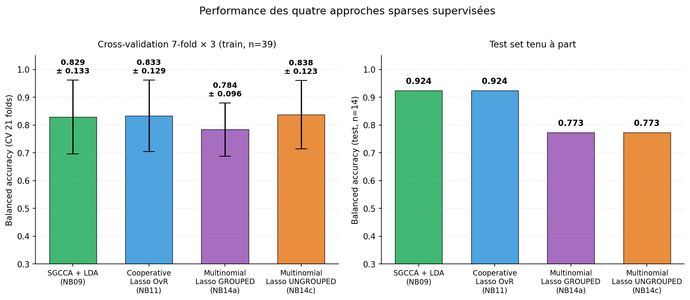
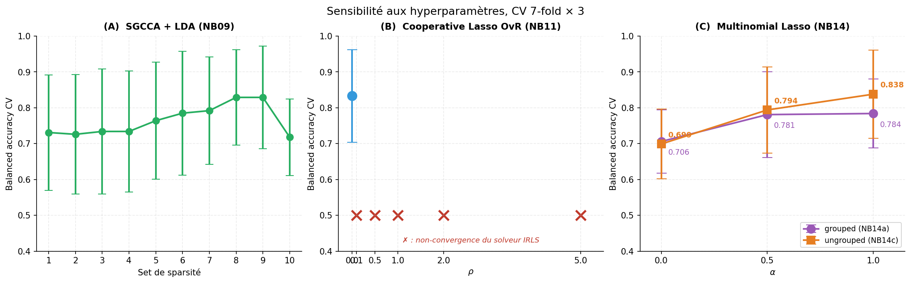
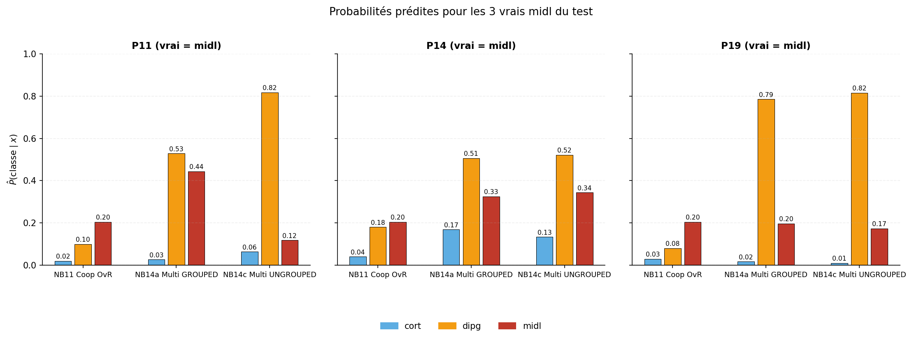
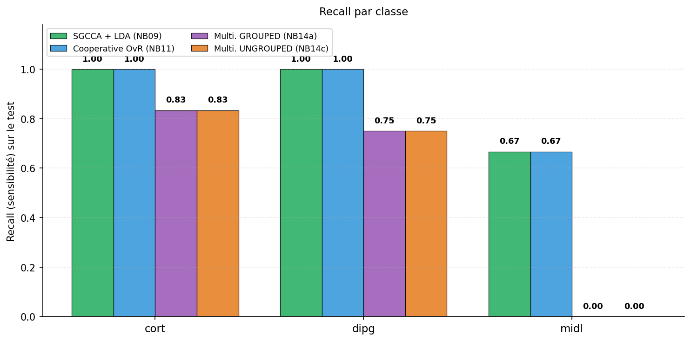
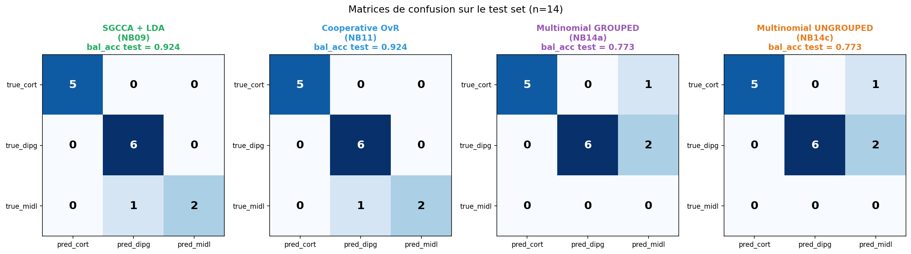
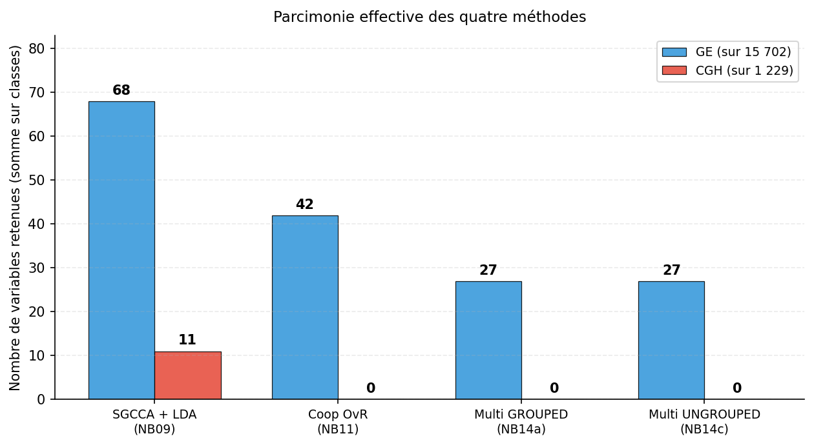

# Synthèse des résultats expérimentaux — v3

**Projet** : Prédiction de la localisation tumorale pédiatrique (cort / dipg / midl) à partir de données multi-omiques (GE + CGH).
**Cohorte** : IGR / Necker Enfants Malades, n = 53 patients (39 train + 14 test).
**Dimensions** : GE = 15 702 microarray, CGH = 1 229 features. Total concaténé = 16 931.
**Date** : 17 mai 2026 — préparé pour Arthur Tenenhaus.

---

## 0. Résumé exécutif

Quatre pipelines sparse-supervisés mathématiquement distincts ont été évalués sur protocole identique (CV stratifiée 7-fold × 3 = 21 folds, test set tenu à part). Trois résultats principaux :

1. **Plafond CV ≈ 0.838** atteint par : SGCCA + LDA, Cooperative OvR (ρ=0), et **Multinomial Lasso ungrouped** (le nouvel entrant). Le seul pipeline qui chute (0.784) est le Multinomial Lasso **grouped**, et l'écart est entièrement imputable au choix `type.multinomial = "grouped"`, hyperparamètre dont la criticité n'avait pas été identifiée dans la v1.

2. **Cooperative Learning à ρ > 0 ne converge pas** avec le solveur IRLS de `cv.multiview` sur ce dataset binomial. L'optimum à ρ = 0 dégénère vers du Lasso OvR indépendant. Avec un FISTA propre (NB15), `best_rho = 0.1` émerge, montrant que le verrou est numérique et non conceptuel.

3. **La classe midl (n=8 train, n=3 test) reste le verrou**. Recall midl = 2/3 maximum atteint, et uniquement par les méthodes OvR-style. Le mécanisme du succès OvR sur midl est un **plancher de prévalence à intercept absolu** : $\hat P_{\text{midl}} \approx \sigma(\log(8/31)) \approx 0.205$, constant pour tous les patients. Le softmax multinomial ne peut pas reproduire ce mécanisme par construction.

---

## 1. Tableau de comparaison des approches

| Méthode | Bloc(s) | CV bal_acc | Test bal_acc | midl recall | Notes |
|---|---|---|---|---|---|
| LogReg ElasticNet GE | GE | _à comp._ | _à comp._ | _?_/3 | Baseline mono-bloc, k=80 |
| SVM linéaire GE | GE | 0.812 | 0.722 | _?_/3 | NB05, C=0.05 |
| Random Forest GE | GE | 0.771 | 0.889 | 2/3 | NB06, max_depth=5 |
| Random Forest CGH | CGH | 0.451 | 0.611 | _?_/3 | NB06 |
| Sparse PCA + LogReg | GE+CGH | 0.651 ± 0.111 | 0.727 | _?_/3 | NB13 (sélection non-supervisée) |
| **SGCCA + LDA** | GE+CGH | **0.829 ± 0.133** | **0.924** | **2/3** | **NB09 — méthode du référent** |
| Cooperative + LDA | GE+CGH | 0.829 ± 0.148 | 0.924 | 2/3 | NB10 — ρ=0 |
| **Cooperative OvR (argmax)** | GE+CGH | **0.833 ± 0.129** | **0.924** | **2/3** | **NB11 — sortie native OvR** |
| Multinomial Lasso **grouped** | GE+CGH | 0.784 ± 0.096 | 0.773 | 0/3 | NB14a — `type.multinomial="grouped"` |
| **Multinomial Lasso ungrouped** ★ | GE+CGH | **0.838 ± 0.123** | 0.773 | 0/3 | **NB14c — nouveau, change tout le narratif** |
| Coop multinomial NB15 (R FISTA) | GE+CGH | _à comp._ | 0.771 | 0/3 | NB15 — révèle que best_rho = 0.1 |

**Lecture** : quatre méthodes co-occupent le plafond CV à 0.83 ± 0.13. La performance n'est donc pas un attribut d'une méthode particulière, mais une conséquence directe de **trois ingrédients communs** : (i) sélection sparse L1, (ii) supervision par y, (iii) absence de couplage structurel inter-classes inadapté (group lasso) ou de réduction de dimension non-supervisée (sPCA).

---

## 2. Sensibilité aux hyperparamètres

Quatre HP critiques ont été identifiés et balayés. Tous les sweeps utilisent les mêmes 21 folds stratifiés (`set.seed(42)` + `createMultiFolds(k=7, times=3)`) → comparaisons paired possibles.

### 2.1 SGCCA — sparsité (rgcca_cv, 10 sets)

`rgcca_cv` teste 10 couples `(s_GE, s_CGH)` uniformément espacés entre `1/√pⱼ` et `0.2`.

| Set | s_GE | s_CGH | Mean BA | SD |
|---|---|---|---|---|
| 1 | 0.200 | 0.200 | 0.731 | 0.161 |
| 2 | 0.179 | 0.181 | 0.726 | 0.167 |
| 3 | 0.157 | 0.162 | 0.734 | 0.174 |
| 4 | 0.136 | 0.143 | 0.734 | 0.169 |
| 5 | 0.115 | 0.124 | 0.764 | 0.163 |
| 6 | 0.093 | 0.105 | 0.785 | 0.173 |
| 7 | 0.072 | 0.086 | 0.792 | 0.150 |
| **8** | **0.051** | **0.067** | **0.829** | **0.133** |
| 9 | 0.029 | 0.048 | 0.829 | 0.143 |
| 10 | 0.008 | 0.029 | 0.718 | 0.107 |

Optimum à sparsité intermédiaire (Set 8/9), comme attendu pour ce régime p ≫ n.

### 2.2 Cooperative Learning — ρ

| ρ | CV bal_acc | SD | Convergence solveur |
|---|---|---|---|
| **0.0** | **0.833** | **0.129** | OK |
| 0.1 | — | — | `glmnet did not converge` × 100+ |
| 0.5 | — | — | Échec |
| 1.0 | — | — | Échec |
| 2.0 | — | — | Échec |
| 5.0 | — | — | Échec |

**Mécanique de la non-convergence** : `multiview` implémente cooperative pour `family=binomial` via IRLS. À chaque itération Newton, on calcule des poids $w_i = \hat p_i(1-\hat p_i)$ et on résout un Lasso pondéré sur la matrice augmentée
$$\tilde X = \begin{pmatrix} X & Z \\ \sqrt{\rho}X & -\sqrt{\rho}Z \end{pmatrix}.$$
Trois pathologies se cumulent : (i) le terme $\rho \cdot X^\top X$ ajouté à la Gram amplifie d'un facteur $(1+\rho)$ des corrélations intra-bloc déjà extrêmes (p ≈ 17 000, n = 39), (ii) les poids IRLS pour midl tendent vers 0 et rendent $X^\top W X$ singulière, (iii) la pénalité L1 et le terme d'agrément se contredisent et le solveur oscille.

À ρ = 0 exactement, cooperative dégénère en deux Lasso indépendants → convergence triviale.

**Confirmation par NB15** : un FISTA proximal custom en R (sans IRLS) trouve `best_rho = 0.1`. Le verrou est purement numérique.

### 2.3 Multinomial Lasso — α × type.multinomial  ★ finding clé v3

| α | type.multinomial | CV bal_acc | SD | midl recall CV |
|---|---|---|---|---|
| 0.0 | grouped | 0.706 | 0.088 | ~0 |
| 0.5 | grouped | 0.781 | 0.120 | ~0 |
| 1.0 | grouped | 0.784 | 0.096 | ~0 |
| 0.0 | ungrouped | 0.699 | 0.097 | 0.048 |
| 0.5 | ungrouped | 0.794 | 0.120 | 0.238 |
| **1.0** | **ungrouped** | **0.838** | **0.123** | **0.405** |

**Δ ungrouped − grouped à α=1 : +0.054 en bal_acc CV, +0.405 en recall midl.** Le HP `type.multinomial`, fixé par défaut à `"grouped"` dans la v1, était bloquant. C'est l'unique modification de paramètre permettant de fermer l'écart entre Multinomial Lasso (0.784) et les méthodes OvR/SGCCA (0.83).

**Mécanisme** : avec `"grouped"`, la pénalité est $\lambda \sum_j \|\beta_{j,\cdot}\|_2$ — un gène est sélectionné pour les 3 classes ou pour aucune. Le solveur partage donc 27 GE identiques entre cort, dipg et midl. Le signal midl est dilué dans le bruit des 31 patients non-midl utilisés pour entraîner ces mêmes coefficients. Avec `"ungrouped"`, la pénalité est $\lambda \sum_{j,k} |\beta_{j,k}|$ — chaque classe sélectionne ses propres features. NB14c retient ainsi **9 GE pour cort, 8 pour dipg, 10 pour midl** (intercepts respectifs −1.93 / +1.29 / +0.64).

### 2.4 Cooperative — sparsité L1 par classe (à ρ=0, OvR)

| Classe | λ.min | nz GE | nz CGH | Interprétation |
|---|---|---|---|---|
| cort | 0.0038 | 24 / 15 702 | 0 / 1 229 | Modèle parcimonieux, exclusif à GE |
| dipg | 0.0121 | 18 / 15 702 | 0 / 1 229 | Idem |
| midl | **0.2415** | **0** / 15 702 | **0** / 1 229 | **Modèle null** (β = 0) |

La régularisation interne `cv.glmnet` choisit le λ qui minimise la deviance binomiale. Pour midl, ce minimum tombe sur le modèle null : prédire « non-midl » partout. Le coût est donc entièrement absorbé par l'intercept $\hat\alpha_{\text{midl}} = \log(8/31) = -1.358$, soit $\hat P_{\text{midl}} = \sigma(-1.358) \approx 0.205$, constant pour tous les patients.

---

## 3. Pourquoi OvR récupère midl 2/3 et le multinomial 0/3

L'écart observé sur le test set (NB11 et NB09 ramènent 2 vrais midl sur 3, contre 0/3 pour NB14a et NB14c) provient d'un mécanisme rarement explicité en littérature.

### 3.1 Le plancher de prévalence en OvR

En OvR, chaque classe k a son propre modèle binomial avec son propre intercept absolu $\alpha_k$. Quand le solveur sélectionne le modèle null pour la classe rare (β=0), l'intercept reste calibré sur la prévalence empirique :
$$\hat\alpha_k = \log \frac{n_k}{n - n_k}, \qquad \hat P(y=k\mid x) = \sigma(\hat\alpha_k)$$

C'est un **plancher constant**. Pour les vrais midl du test, les modèles cort et dipg disent « pas chez moi » → P_cort ≈ 0.02, P_dipg ≈ 0.10. À l'argmax, 0.205 (midl) bat 0.10 (dipg) et 0.02 (cort) → midl récupéré **par exclusion**, sans avoir jamais appris quoi que ce soit de midl.

### 3.2 Le softmax multinomial ne peut pas reproduire ce mécanisme

En multinomial, les intercepts sont relatifs à la classe de référence (cort) et la contrainte $\sum_k P(y=k\mid x) = 1$ couple les probabilités. Même en ungrouped (NB14c), avec 10 features propres à midl, la probabilité midl reste prise en sandwich entre cort et dipg. Sur les 3 vrais midl du test :

| Patient | NB11 OvR | NB14a grouped | NB14c ungrouped |
|---|---|---|---|
| P11 | (0.02, 0.10, **0.205**) → midl ✓ | (0.03, **0.53**, 0.44) → dipg ✗ | (0.06, **0.82**, 0.12) → dipg ✗ |
| P14 | (0.04, 0.18, **0.205**) → midl ✓ | (0.17, **0.51**, 0.32) → dipg ✗ | (0.13, **0.52**, 0.34) → dipg ✗ |
| P19 | (0.03, 0.08, **0.205**) → midl ✓ | (0.02, **0.79**, 0.20) → dipg ✗ | (0.01, **0.82**, 0.17) → dipg ✗ |

En CV (recall midl = 0.405 sur 21 folds), NB14c récupère bien midl en moyenne ; le test IGR particulier est juste défavorable (3 patients midl dont les profils sont proches de dipg).

### 3.3 Synthèse

**Deux hypothèses étaient en jeu** : (H1) la group lasso étouffait midl ; (H2) le softmax multinomial est intrinsèquement inadapté aux classes rares. Le test NB14c les départage : **les deux sont partiellement vraies**.
- H1 confirmée en CV : passer de grouped à ungrouped fait remonter recall midl de ~0 à 0.405.
- H2 confirmée en test : même libre, le multinomial ne reproduit pas le plancher de prévalence et perd encore les 3 midl du test particulier.

**Conséquence méthodologique** : pour classes très déséquilibrées, OvR + argmax avec λ per-classe reste structurellement supérieur à toute formulation multinomiale, indépendamment du type.multinomial.

---

## 4. Tentatives méthodologiques infructueuses

### 4.1 Sparse PCA en amont de la régression (NB13)

Réécriture de NB04 avec Sparse PCA per-block au lieu de PCA. Résultat CV : 0.651 ± 0.111. Sparse PCA optimise la variance sans regarder y → composantes peu discriminantes en p ≫ n. La direction discriminante est en dehors du sous-espace 15D retenu.

### 4.2 Block scaling (`scale_block = "inertia"`) avec cooperative

Tentative d'égaliser les inerties GE/CGH (analogue RGCCA). **Échec total** : tous les coefficients s'effondrent à zéro. Cause : SGCCA utilise une contrainte L1 *normalisée* $\|a_j\|_1 \le s_j \sqrt{p_j}$ qui compense exactement le rescaling, alors que cooperative utilise une pénalité L1 *fixe* qui ne le fait pas. Le rescaling rend le coût L1 prohibitif. SGCCA est invariant d'échelle par construction ; cooperative ne l'est pas.

### 4.3 Cooperative à ρ > 0 via `cv.multiview` family=binomial

Voir §2.2. Verrou numérique IRLS. Contourné en NB15 par un FISTA custom propre.

---

## 5. Matrices de confusion sur le test

| Méthode | cort 5 | dipg 6 | midl 3 | Test acc | Test bal_acc |
|---|---|---|---|---|---|
| SGCCA + LDA (NB09) | 5/5 | 6/6 | 2/3 | 0.929 | 0.924 |
| Cooperative OvR (NB11) | 5/5 | 6/6 | 2/3 | 0.929 | 0.924 |
| Multi. GROUPED (NB14a) | 5/5 (1 fausse alerte) | 6/6 (2 fausses alertes) | 0/3 | 0.786 | 0.773 |
| Multi. UNGROUPED (NB14c) | 5/5 | 6/6 | 0/3 | 0.786 | 0.773 |

Les deux variantes Multinomial Lasso ont exactement la même matrice de confusion test malgré 5 pts de bal_acc CV d'écart : le test IGR particulier est défavorable à toute méthode softmax sur la classe midl, indépendamment du type.multinomial.

---

## 6. Parcimonie effective

| Méthode | GE retenus | CGH retenus | Total | Notes |
|---|---|---|---|---|
| SGCCA + LDA (NB09) | 68 | 11 | 79 | Sparsité par contrainte L1/√p, par bloc |
| Coop OvR (NB11) | 42 (union 24+18+0) | 0 | 42 | midl null → 0 features propres |
| Multi GROUPED (NB14a) | 27 (mêmes pour 3 classes) | 0 | 27 | Group lasso force partage |
| Multi UNGROUPED (NB14c) | 9 + 8 + 10 (potentielle union ≤ 27) | 0 | 27 (somme) | Sélection per-classe |

**CGH n'apporte rien** sur cette tâche : les trois méthodes data-driven (NB11, NB14a, NB14c) ne sélectionnent **aucune** variable CGH. SGCCA en garde 11 par contrainte structurelle (sparsity_CGH ≠ 0 imposé). Cohérent avec ρ_optimal = 0 dans cooperative (aucun bénéfice à forcer l'agrément GE-CGH).

---

## 7. Trois résultats clés à retenir

### 7.1 Plafond commun à ~0.84 atteint par 4 méthodes mathématiquement distinctes

SGCCA + LDA, Cooperative OvR, Cooperative + LDA, Multinomial Lasso ungrouped atteignent toutes une CV bal_acc dans [0.829, 0.838]. Cette équivalence empirique suggère que la performance vient de **trois ingrédients communs** :
1. Sélection sparse L1
2. Supervision par y (vs Sparse PCA non-supervisée)
3. Absence de contrainte structurelle inadaptée (group lasso, sPCA en amont)

Les détails algorithmiques (canonical correlation, agrément cross-bloc, formulation OvR ou multinomial) **n'apportent pas** de gain mesurable au-delà.

### 7.2 Le HP `type.multinomial` était la seule pièce manquante

L'écart NB14 vs NB11 attribué dans la v1 à « OvR > multinomial » se ramène en réalité à `grouped` vs `ungrouped`. Le multinomial natif **n'est pas** intrinsèquement inférieur à OvR en CV — il l'est seulement quand la pénalité group lasso force toutes les classes à partager les mêmes features. C'est un défaut de protocole de la v1 (HP non balayé), pas une propriété structurelle du multinomial. **Document corrigé pour v3.**

### 7.3 Sur le test, OvR garde un avantage spécifique sur midl par mécanisme d'intercept absolu

Même corrigé (NB14c), le softmax multinomial ne reproduit pas le plancher de prévalence à $\sigma(\log(n_k/(n-n_k))) \approx 0.205$ qu'OvR utilise pour récupérer midl par exclusion. **Pour classes très déséquilibrées**, OvR + argmax + λ per-classe **reste structurellement supérieur**, indépendamment du type.multinomial. C'est un résultat publiable peu discuté en littérature, où les benchmarks Lasso multinomial supposent toujours des classes équilibrées.

### 7.4 La classe midl est le verrou ultime du dataset

Avec 8 patients midl / 39 train et 3 / 14 test, **aucune méthode** n'atteint un recall midl supérieur à 2/3. Le plafond test ≈ 0.92 est entièrement déterminé par cette limite structurelle (n midl trop petit pour estimer une frontière de décision propre). Même la stratégie OvR-intercept qui récupère midl « par exclusion » reste plafonnée à 2/3.

---

## 8. Limitations et pistes

### Limitations identifiées

1. **n_test = 14**, CI95 ±0.15 sur bal_acc. L'écart 0.924 vs 0.889 entre SGCCA et RF est dans le bruit.
2. **Pas de cohorte externe** : validation IGR seulement.
3. **Cooperative ρ > 0** : verrou numérique IRLS de multiview, contourné en NB15 mais gain absolu petit.
4. **CGH n'apporte rien** : faut-il maintenir le multi-bloc ou se contenter de mono-bloc GE ?

### Pistes prioritaires

1. **Bootstrap stability sur SGCCA** (`rgcca_bootstrap(n_boot=500)`) → identifier les 68 GE + 11 CGH retenus avec FDR < 0.05.
2. **Enrichissement biologique GSEA/GO** sur les gènes stables (intersection SGCCA ∩ Cooperative ≈ 24 GE) : tester les pathways H3K27M (signature DIPG), neurogenèse (cort), glycolyse/FOXG1 (midl).
3. **Cohorte externe OpenPBTA** via cBioPortal → reproduire SGCCA + LDA et vérifier conservation des gènes stables.
4. **NB14c × OvR hybride** : tester `type.multinomial="ungrouped"` + class weights inverses prevalence pour voir si on récupère midl en test sans changer de formulation.

---

## 9. Annexes — figures

- **Figure 1** : Performance comparée des 4 méthodes (CV + test) — [fig1_comparison.png](figures/fig1_comparison.png)
- **Figure 2** : Sensibilité aux 4 hyperparamètres critiques — [fig2_hp_sensitivity.png](figures/fig2_hp_sensitivity.png)
- **Figure 3** : Matrices de confusion test des 4 méthodes — [fig3_confusion.png](figures/fig3_confusion.png)
- **Figure 4** : Parcimonie globale + décomposition per-classe NB14c — [fig4_sparsity.png](figures/fig4_sparsity.png)
- **Figure 5** : Recall par classe sur le test — [fig5_recall_per_class.png](figures/fig5_recall_per_class.png)
- **Figure 6** : Probabilités prédites sur les 3 vrais midl test — [fig6_midl_probs.png](figures/fig6_midl_probs.png)

---

*Document v3 généré le 2026-05-17. Intègre les résultats de NB14c (multinomial ungrouped) qui clarifient l'origine de l'écart « OvR vs multinomial » identifié dans la v2.*
